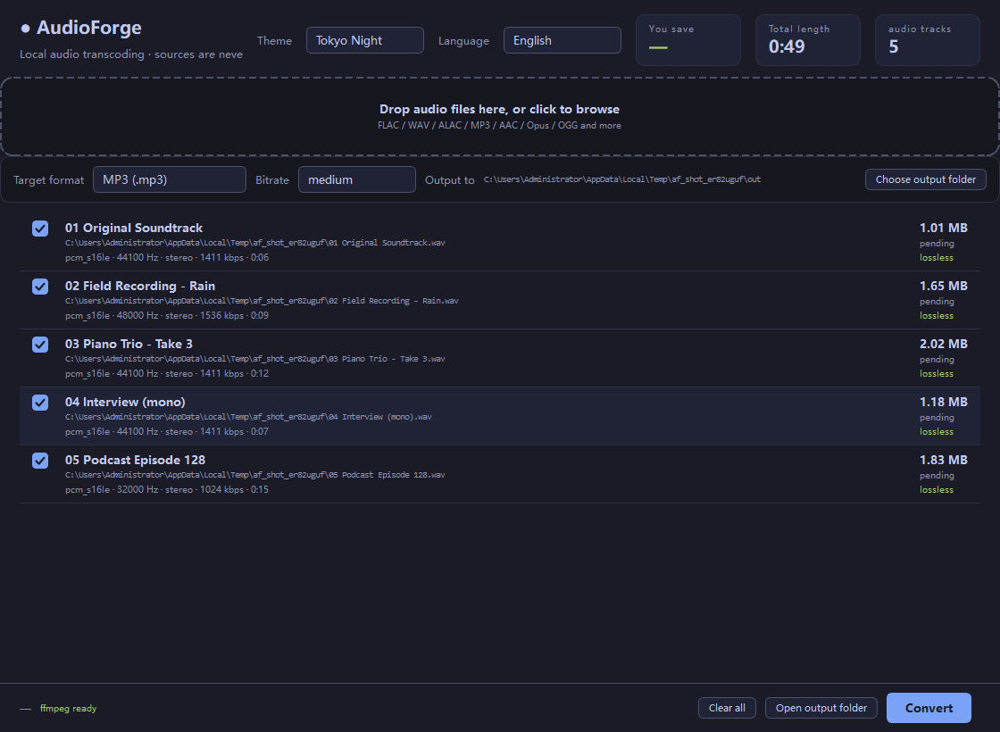
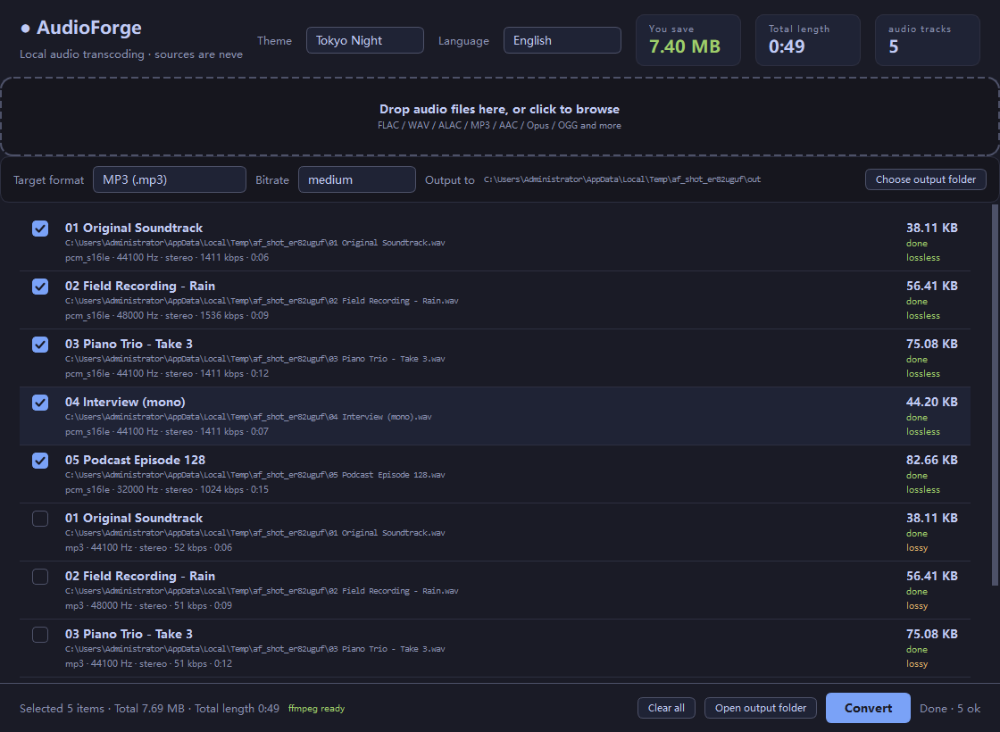
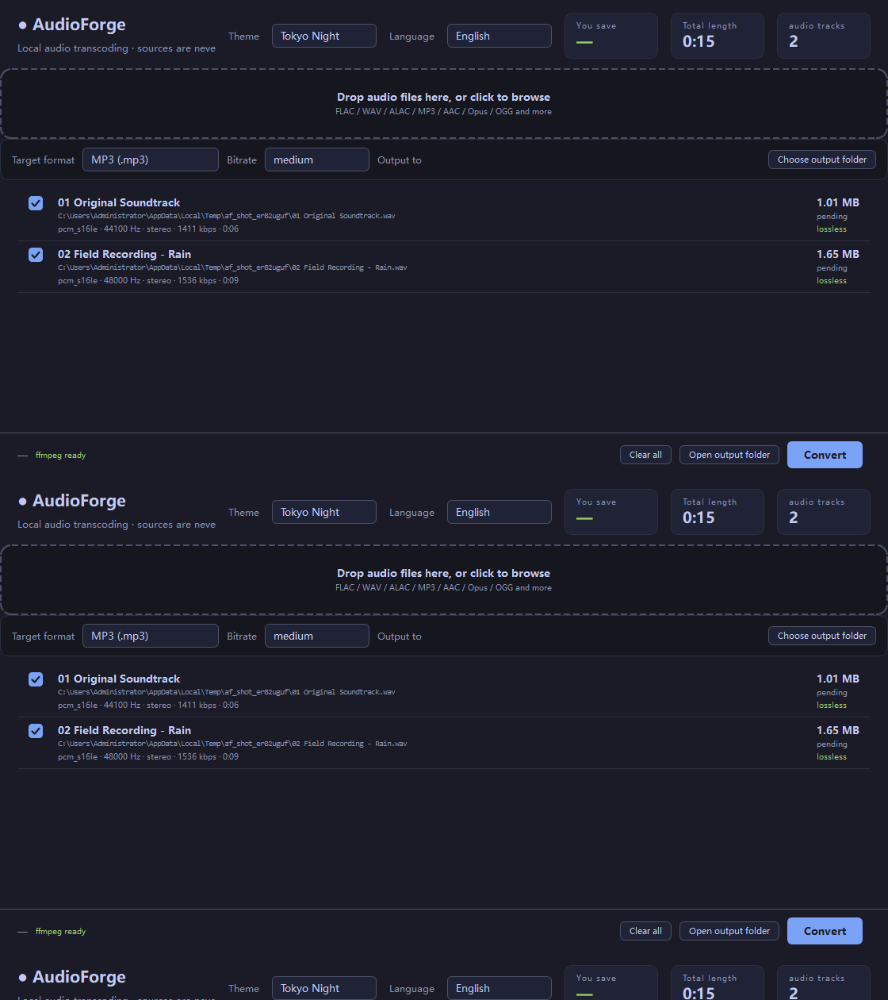

# Screenshots

[中文](Screenshots.md)

Captured by `docs/shoot.py` — a real offscreen window, and the numbers come from an actual conversion
rather than being posed.

> Regenerate with `python docs/shoot.py`; add `en` for the English UI.

## Main window

Drop zone, target format, bitrate, output folder, and the file list with codec, sample rate, channels,
duration and a lossless/lossy tag per row.

## After converting

The "You save" tile shows the total size change; the footer summarises the current selection.

## Six themes

Switched from the top-right, written back to `settings.yaml`. All verified against WCAG AA (4.5:1).

