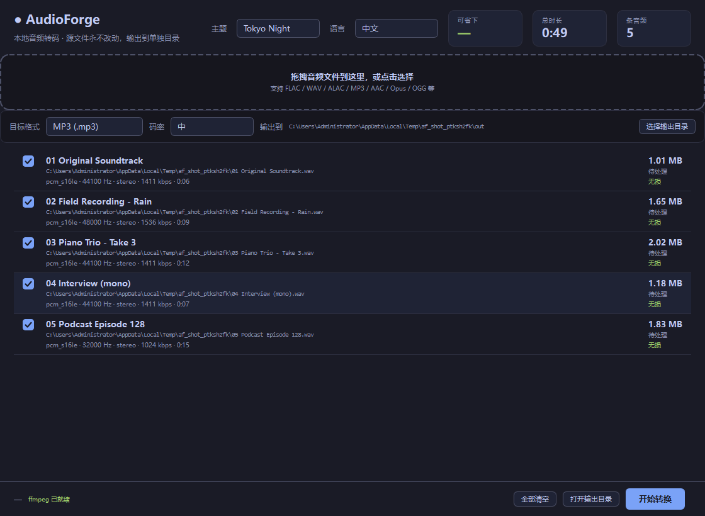
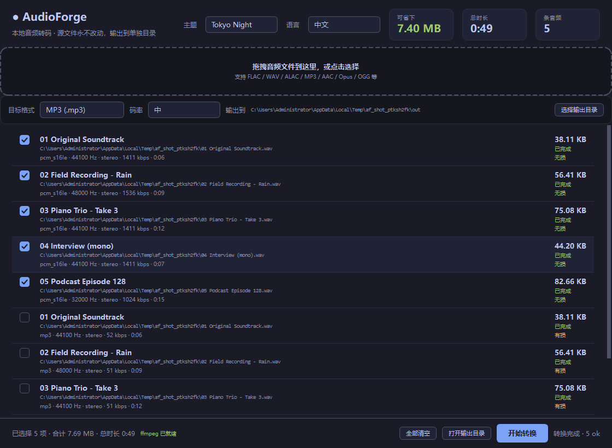
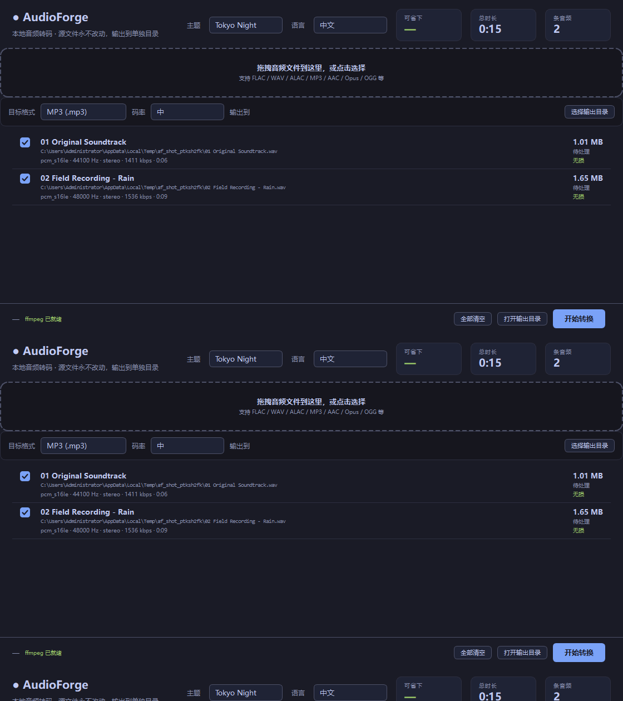

# 截图 / Screenshots

[English](Screenshots.en.md)

截图由 `docs/shoot.py` 生成 —— 离屏渲染真窗口，转换的数字是真跑出来的，不是摆拍。

> 由 `python docs/shoot.py` 生成。英文版用 `python docs/shoot.py en`。

## 主界面

拖拽区 + 目标格式 + 码率 + 输出目录 + 文件列表（每条带编码、采样率、声道、时长、有损/无损）。

## 转换完成

顶部的「可省下」显示总体积变化，底栏是选中集合的汇总。

## 六套主题

右上角切换，选择写回 `settings.yaml`。全部按 WCAG AA（4.5:1）校验。

